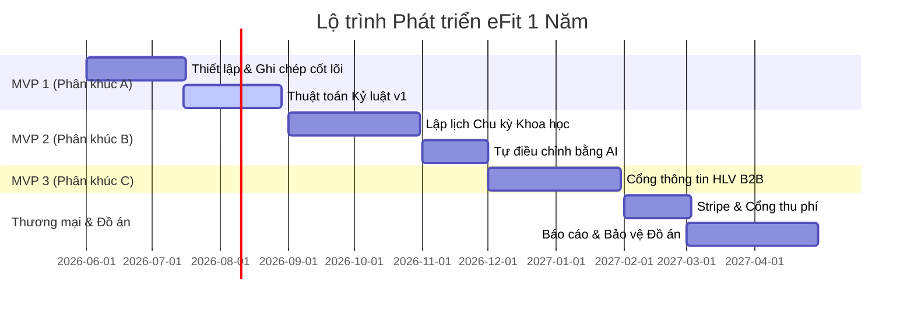
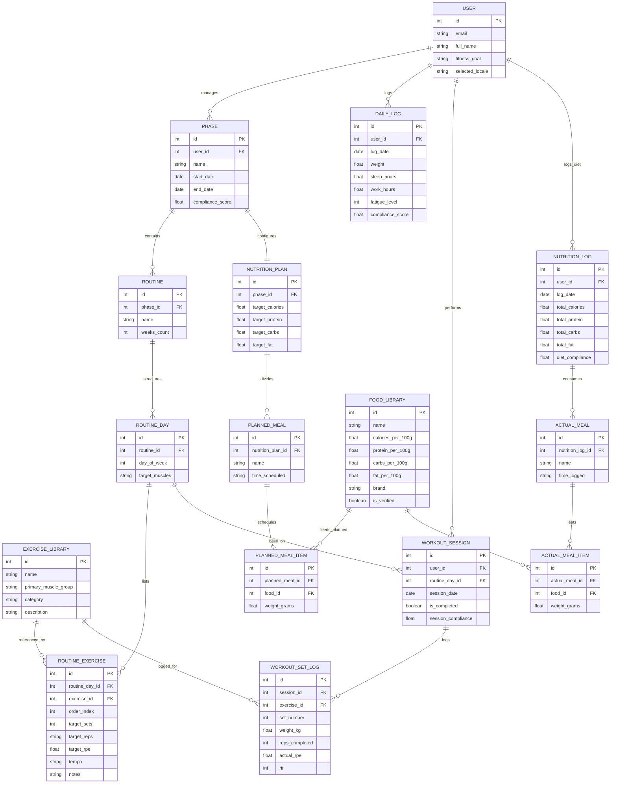

# Phân tích Nghiệp vụ Chiến lược & Lộ trình Phát triển eFit
## Hệ thống Lập lịch Tập luyện Chu kỳ Tối ưu hóa bằng Trí tuệ Nhân tạo (AI-First)

Tài liệu này đóng vai trò là **Tài liệu Tả nghiệp vụ (BRD)** và **Lộ trình Phát triển Công nghệ** cho đồ án tốt nghiệp eFit. Được thiết kế dành cho một nhà phát triển độc lập (Solo Developer) thực hiện trong thời gian 1 năm, tài liệu này vạch rõ lộ trình chuyển đổi từ một ứng dụng ghi chép tập luyện cơ bản (Phân khúc A) sang một công cụ lập lịch chu kỳ chuyên sâu khoa học (Phân khúc B) và cuối cùng là cổng thông tin quản lý dành cho Huấn luyện viên B2B (Phân khúc C).

---

## 1. Lộ trình Phát triển 1 Năm (Phân chia theo Quý)

Với thời gian tối thiểu 1 năm dành cho một lập trình viên duy nhất, chúng ta có một lịch trình vô cùng thoải mái để hoàn thiện một công trình đồ án tốt nghiệp xuất sắc. Chúng ta sẽ chia dự án thành 4 Quý, đảm bảo mỗi quý đều cho ra một sản phẩm chạy được (MVP) có thể demo thực tế.

### Quý 1: MVP 1 (Phân khúc A - Người tập Gym phổ thông)
*   **Trọng tâm**: Xây dựng vững chắc cấu trúc cơ sở dữ liệu, bộ ghi chép cốt lõi và thuật toán tính Điểm Kỷ luật nền tảng.
*   **Kết quả bàn giao**:
    *   Xác thực người dùng (Đăng ký/Đăng nhập), cấu hình thông tin cá nhân (mục tiêu, thể trạng).
    *   Lập kế hoạch tập luyện đơn giản (Tạo giáo án mẫu hàng tuần, ví dụ: lịch tập 3 buổi hoặc 4 buổi một tuần).
    *   Nhật ký sức khỏe hàng ngày (Ghi nhận Cân nặng, Giờ ngủ, Giờ làm việc, Mức độ mệt mỏi).
    *   **Thuật toán Kỷ luật v1**: Tính toán điểm số chuyên cần và tuân thủ lịch tập luyện hàng tuần.
    *   *Demo thực tế*: Một Dashboard tối giản hiển thị biểu đồ chỉ số sức khỏe, check-in buổi tập và hiển thị "Điểm Kỷ luật" tăng giảm trực quan.

### Quý 2: MVP 2 (Phân khúc B - Người tập nâng cao & Chu kỳ hóa khoa học)
*   **Trọng tâm**: Tích hợp khoa học thể thao, theo dõi mức độ mệt mỏi hệ thần kinh và cơ chế tự động điều chỉnh giáo án bằng AI (Autoregulation).
*   **Kết quả bàn giao**:
    *   **Bộ dựng chu kỳ (Periodization Block Builder)**: Tổ chức giáo án thành các chu kỳ nhỏ (Hypertrophy - Tăng cơ, Strength - Sức mạnh, Deload - Xả cơ, Peak - Đạt đỉnh).
    *   **Bộ ghi nhận RPE/RIR**: Người dùng log chỉ số RPE (Mức độ cảm nhận nỗ lực) và RIR (Số reps còn lại trong bể) cho từng hiệp tập chính.
    *   **Bộ tự điều chỉnh giáo án (Autoregulation Controller)**: Cho phép người dùng chọn tần suất tự động điều chỉnh:
        *   *Theo Buổi*: Thay đổi mức tạ/số reps của buổi tới dựa trên hiệu suất và độ mệt mỏi của buổi hôm nay.
        *   *Theo Tuần*: Phân tích chỉ số mệt mỏi trung bình tuần để tự tăng/giảm khối lượng tập luyện (Volume) tuần tới.
        *   *Theo Chu kỳ (Phase)*: Tự động nhắc nhở người tập bước vào tuần Deload (xả cơ) hoặc Peak (đạt đỉnh) khi các chỉ số mệt mỏi tích lũy vượt ngưỡng an toàn.
    *   **AI Planner v2**: Kết nối trực tiếp với Gemini/OpenAI SDK để phân tích nhật ký tập luyện và xuất ra lời khuyên/giáo án tối ưu hóa riêng biệt.

### Quý 3: MVP 3 (Phân khúc C - Cổng thông tin Huấn luyện viên B2B)
*   **Trọng tâm**: Mở rộng kiến trúc hệ thống để hỗ trợ quan hệ đa người dùng (Multi-tenant) giữa Huấn luyện viên cá nhân (PT) và nhiều học viên.
*   **Kết quả bàn giao**:
    *   **Dashboard cho Huấn luyện viên**: Giao diện tổng quan cho phép PT theo dõi danh sách và tình trạng tập luyện của tất cả học viên đang quản lý.
    *   **Cổng phân phối giáo án**: Cho phép PT thiết kế chu kỳ tập luyện (Periodization) và thực đơn dinh dưỡng riêng, sau đó áp trực tiếp vào tài khoản của học viên.
    *   **Hệ thống Phân tích thời gian thực**: PT theo dõi trực tiếp Điểm Kỷ luật, biểu đồ mệt mỏi CNS, và biến động cân nặng của từng học viên.

### Quý 4: Thương mại hóa, Tinh chỉnh hệ thống & Bảo vệ Đồ án
*   **Trọng tâm**: Triển khai mô hình SaaS thương mại, tối ưu hóa trải nghiệm người dùng cao cấp và hoàn thiện tài liệu học thuật.
*   **Kết quả bàn giao**:
    *   **Hệ thống Thu phí (Mô hình 1)**: Khóa các tính năng phân tích AI nâng cao và cổng thông tin HLV sau bức tường thanh toán (Stripe Subscription Paywall).
    *   Kiểm thử tích hợp toàn bộ hệ thống & Tối ưu hóa hiệu năng ứng dụng.
    *   Viết Báo cáo Đồ án Tốt nghiệp (tập trung vào thuật toán Chu kỳ hóa, kiến trúc tích hợp AI và mô hình triển khai DevOps với Docker).

---

## 2. Mô hình Toán học eFit: Thuật toán Kỷ luật & Chỉ số Mệt mỏi

Để đạt điểm số tối đa khi bảo vệ đồ án tốt nghiệp, bạn cần thể hiện các **mô hình toán học và phân tích thuật toán** chặt chẽ thay vì chỉ viết code CRUD thông thường. Chúng ta định nghĩa các chỉ số cốt lõi sau:

### A. Điểm Kỷ luật Tuần tổng hợp (Weekly Compliance Score)
Điểm kỷ luật tuần được tính toán từ Kỷ luật tập luyện ($C_F$) và Kỷ luật ghi chép chỉ số sức khỏe hàng ngày ($C_L$):

$$C_{\text{weekly}} = w_F \cdot C_F + w_L \cdot C_L$$

Trong đó:
*   $C_F = \min\left(100, \frac{\text{Số buổi đã hoàn thành}}{\text{Số buổi lên lịch ban đầu}} \cdot 100\right)$
*   $C_L = \frac{\text{Số ngày đã ghi chỉ số}}{7} \cdot 100$
*   $w_F = 0.7$ (Trọng số độ quan trọng của việc đi tập đủ buổi)
*   $w_L = 0.3$ (Trọng số của việc duy trì ghi chép sức khỏe hàng ngày)

### B. Chỉ số Mệt mỏi Hàng ngày (Daily Fatigue Index - DFI)
Chỉ số mệt mỏi CNS hệ thần kinh được tự động lượng hóa trên thang điểm từ 0 đến 100 dựa trên nhật ký hàng ngày của người dùng:

$$\text{DFI} = (w_S \cdot F_{\text{sleep}}) + (w_W \cdot F_{\text{work}}) + (w_R \cdot F_{\text{subjective}})$$

Trong đó:
*   $F_{\text{sleep}} = \max\left(0, \frac{8 - \text{Số giờ ngủ thực tế}}{8} \cdot 100\right)$ (Chỉ số nợ giấc ngủ)
*   $F_{\text{work}} = \min\left(100, \frac{\text{Số giờ làm việc}}{10} \cdot 100\right)$ (Chỉ số căng thẳng công việc)
*   $F_{\text{subjective}} = \text{Mức mệt mỏi chủ quan (1-5)} \cdot 20$ (Tỷ lệ mệt mỏi cảm nhận)
*   $w_S = 0.4, w_W = 0.3, w_R = 0.3$ (Các hệ số trọng số tương ứng)

*Đề xuất thuật toán AI*: Khi **DFI > 75** liên tục trong 3 ngày và **Weekly Compliance < 60%**, động cơ AI sẽ tự động kích hoạt **Đề xuất Tuần Deload (Xả cơ)** gửi tới người dùng để ngăn chặn chấn thương do tập quá sức.

---

## 3. Thiết kế Cơ sở Dữ liệu Chi tiết (Extended ERD Schema)

Để đáp ứng trọn vẹn yêu cầu khoa học và bài bản của đồ án tốt nghiệp, chúng ta không thể sử dụng một cơ sở dữ liệu phẳng đơn giản. Hệ thống **eFit** cần phân tách rõ ràng thành 3 phân hệ chính:
1.  **Phần chung & Quản lý User (Core)**
2.  **Lập lịch tập luyện khoa học (Planned vs Actual Training)**: Tách biệt giữa giáo án mẫu được thiết lập ban đầu (Planned) và nhật ký thực hiện thực tế (Actual) để đo lường mức độ lệch (Compliance). Hỗ trợ các chỉ số chuyên sâu: số sets, reps, target RPE, tempo tập, ghi chú.
3.  **Quản lý dinh dưỡng theo chu kỳ (Planned vs Actual Nutrition)**: Cho phép lên thực đơn mẫu (Target Calories & Macros) cho từng Phase, chia thành các bữa ăn (Meals) mỗi ngày, các món ăn (Meal Items) được liên kết trực tiếp với một thư viện thực phẩm dinh dưỡng (`FOOD_LIBRARY`).

### A. Sơ đồ Thực thể Quan hệ (Extended ERD)

### B. Chi tiết Nghiệp vụ & Cột dữ liệu chuyên sâu

#### 1. Quản lý Lịch tập khoa học (Planned Training)
Để người tập nâng cao hoặc AI thiết kế giáo án chuyên sâu, bảng `ROUTINE_EXERCISE` lưu trữ các dữ liệu nâng cao:
*   **`target_rpe`**: Mức cảm nhận nỗ lực mục tiêu (ví dụ: RPE 8.0 có nghĩa là khi tập xong hiệp, người tập chỉ còn khả năng làm tối đa 2 cái nữa).
*   **`tempo`**: Nhịp độ tập (ví dụ: `"3-1-1-0"` - 3 giây hạ tạ chậm lập tức giữ 1 giây ở đáy, kéo tạ lên phát lực trong 1 giây, giữ 0 giây ở đỉnh). Đây là chỉ số rất đắt giá đối với các nghiên cứu khoa học thể thao.
*   **`notes`**: Ghi chú kỹ thuật cụ thể từ AI hoặc huấn luyện viên (ví dụ: "Tập trung cảm nhận cơ").

Khi người tập check-in thực tế:
*   Bảng `WORKOUT_SET_LOG` cho phép lưu **`actual_rpe`** và **`rir`** (Reps in Reserve - số reps còn lại trong bể) để đối chiếu với mục tiêu đặt ra ban đầu, giúp AI đánh giá mức độ mệt mỏi hệ thần kinh trung ương (CNS Fatigue).

#### 2. Quản lý Dinh dưỡng theo Phase (Diet Periodization)
Mỗi **Phase** của người tập sẽ được gán với **một thực đơn mẫu lý tưởng** (`NUTRITION_PLAN`). Ví dụ:
*   *Phase Bulking (Xả cơ)*: AI lên kế hoạch 3200 Kcal, 160g Protein, 450g Carbs, 85g Fat.
*   *Phase Cutting (Siết cơ)*: AI tự động giảm nutrition plan xuống còn 2000 Kcal, 175g Protein, 200g Carbs, 55g Fat.

Cấu trúc bữa ăn phân tách:
*   Bữa ăn mẫu (`PLANNED_MEAL`): Ví dụ Bữa sáng (Bữa 1) lúc 07:00.
*   Món ăn mẫu (`PLANNED_MEAL_ITEM`): Chứa liên kết thực phẩm `food_id` và khối lượng mục tiêu (ví dụ: 150g Ức gà, 200g cơm lứt). Dữ liệu Calo và Macros sẽ được tự động tính toán dựa vào công thức:
    $$\text{Macro}_{\text{item}} = \frac{\text{weight\_grams}}{100} \cdot \text{Macro}_{\text{per\_100g\_in\_Food\_Library}}$$

Khi người dùng log thực tế ăn uống:
*   Dữ liệu được lưu trữ trong `NUTRITION_LOG`, `ACTUAL_MEAL` và `ACTUAL_MEAL_ITEM` tương ứng để so sánh trực quan sai lệch dinh dưỡng so với mục tiêu đề ra của Phase.

---

## 4. Phạm vi Chi tiết của MVP 1 (Phân khúc A - Người tập phổ thông)

Để nhanh chóng ra mắt sản phẩm chạy thực tế kiểm chứng thị trường, MVP 1 sẽ tập trung tối đa vào **Phân khúc A (Người tập Gym phổ thông)** để thiết lập vòng lặp cốt lõi:

1.  **Giao diện Giao dịch (Giao diện tối sang trọng, không tiền tố URL)**:
    *   Bảng điều khiển (Dashboard) chính.
    *   Trình ghi chép nhật ký chỉ số sức khỏe hàng ngày (Cân nặng, giấc ngủ).
    *   Danh sách checklist tập luyện hàng tuần.
    *   Nút chuyển đổi ngôn ngữ Việt/Anh tức thì qua Cookie.
2.  **Bộ Điều phối Logic**:
    *   **Theo dõi Kỷ luật Luyện tập**: Tính toán công thức $C_{\text{weekly}}$ trực tiếp.
    *   **Hộp chat AI Trợ lý**: Đọc lịch sử cân nặng, số giờ ngủ và các buổi tập hoàn thành của tuần để đưa ra lời khuyên khích lệ theo cấu trúc prompt mẫu.
3.  **Hạ tầng Công nghệ Local**:
    *   Khởi chạy Docker Compose chứa: PostgreSQL + FastAPI + Next.js 15.
    *   Tự động chạy database migrations bằng cấu hình Alembic Async.
